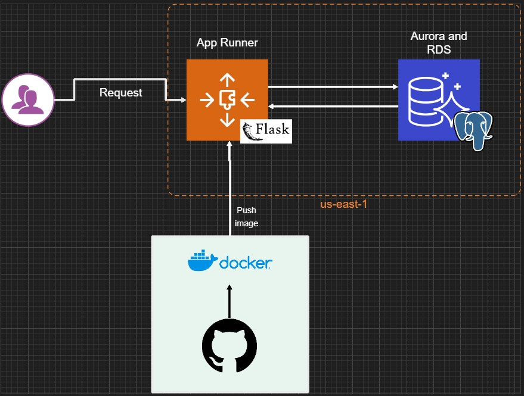

# Project: API with Flask and SQLAlchemy

This project implements an API using Flask and SQLAlchemy to interact with a PostgreSQL database. The API supports querying (GET), updating (UPDATE), batch inserts (BULK), and bulk data loading from CSV files.

## Arquitecture



## Requirements

Before getting started, make sure you have the following installed:

- [Python](https://www.python.org/downloads/) (Recommended: 3.13 or higher)
- [Poetry](https://python-poetry.org/docs/#installation)
- [Docker](https://docs.docker.com/get-docker/)
- [Docker Compose](https://docs.docker.com/compose/install/)
- [DBeaver](https://dbeaver.io/)

## Installing Poetry

Run the following command to install Poetry:

```sh
pipx install poetry==2.1.1
```

Verify the installation with:

```sh
poetry --version
```

## Setting up and activating the virtual environment

To install dependencies and set up the virtual environment:

```sh
poetry install
```

To activate the virtual environment:

```sh
poetry shell
```

## Setting up .env file

Copy `example.env` to `.env` and modified values according your AWS access keys and PostgreSql credentials. For example:

```
DB_HOST=localhost
DB_PORT=5432
DB_NAME=mydatabase
DB_USER=myuser
DB_PASSWORD=mypassword
```

## Deploying with Docker Compose

To start the services with Docker Compose:

```sh
docker-compose -f docker-compose.env.yml up -d
```

To stop the services:

```sh
docker-compose down
```

If you want to rebuild the containers:

```sh
docker-compose -f docker-compose.env.yml up --build -d
```

To check if the services are running:

```sh
docker ps
```

[!IMPORTANT]
Docker compose automatically create `POSTGRES_DB` database and required tablas for this project. Please check out `./init/init_db.sql` file.

## Using the API with Postman

### Importing the Postman Collection

To simplify API testing, we provide a Postman collection that includes pre-configured requests.

### Option 1: Import from a JSON file

1. Download the Postman collection from the repository:
   [API Postman Collection](./docs/postman_collection.json)
2. Open Postman and go to **File > Import**.
3. Select the downloaded JSON file and click **Import**.
4. The collection will appear in your Postman workspace.

## Example Requests

### Retrieve Data (GET)
- **Endpoint:** `GET http://localhost:5000/api/jobs/get/1`
- **Headers:**
  ```json
  {
    "Content-Type": "application/json"
  }
  ```
- **Response:**
  ```json
  [
    { "id": 1, "job": "Data Engineer" }
  ]
  ```

### Update Data (PUT)
- **Endpoint:** `PUT http://localhost:5000/api/jobs/update?id=1`
- **Args:**
    - `id`: Row identifier (1, 2, 3, etc.)
- **Headers:**
  ```json
  {
    "Content-Type": "application/json"
  }
  ```
- **Body:**
  ```json
  {
    "job": "Senior Data Engineer"
  }
  ```
- **Response:**
  ```json
  {
    "id": "1",
    "job": "Senior Data Engineer"
  }
  ```

### Bulk Json (POST)
- **Endpoint:** `POST http://localhost:5000/api/jobs/bulk`
- **Headers:**
  ```json
  {
    "Content-Type": "application/json"
  }
  ```
- **Body:**
  ```json
  [
    {
        "id": 1,
        "job": "Archaeologist"
    },
    {
        "id": 2,
        "job": "Therapist, nutritional"
    }
  ]
  ```
- **Response:**
  ```json
  {
    "message": "2 registros insertados/actualizados"
  }
  ```

### Upload CSV File (POST)
- **Endpoint:** `POST http://localhost:5000/api/jobs/upload-historical?has_header=False&batch_size=1000&csv_schema=id,job`
- **Args:**
    - `has_header`: If the csv has a header or not (True False)
    - `batch_size`: Rows affected per commit (default 1000)
    - `csv_schema`: Required in case is not a header in csv file (id, job)
- **Headers:**
  ```
  Content-Type: multipart/form-data
  ```
- **Body:**
  - Select **form-data**
  - Add a key `file` and choose a CSV file to upload
- **Response:**
  ```json
  {
    "message": "CSV file processed successfully"
  }
  ```

## AWS Endpoint Usage

If the API is deployed to AWS `https://ukmfxwjavi.us-east-1.awsapprunner.com` update the base url according the Postman Collection

> [!IMPORTANT]
> The database and tables must be created previously
> [!CAUTION]
> All tables will be truncated to present this project
